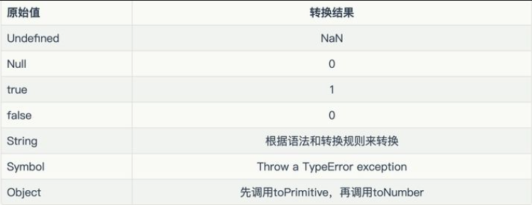
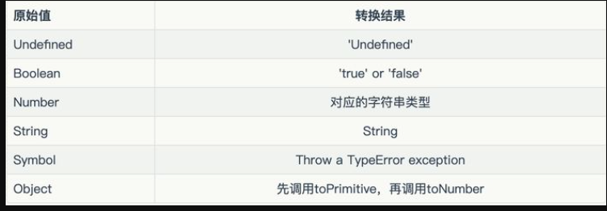
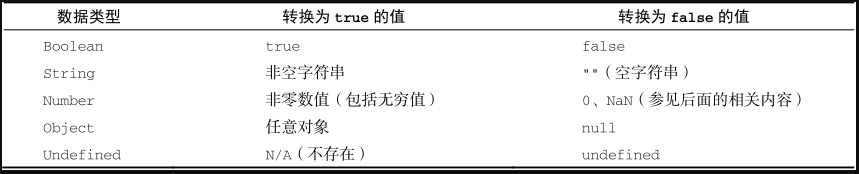

### 转换优先级
1. ToPrimitive 操作：
当对 对象执行一元加法 +obj 或字符串拼接 obj + '' 时，会先调用对象的 valueOf 方法，如果返回的不是原始值，则调用对象的 toString 方法。这种转换优先级最高，可由开发者自定义。

2. 显式类型转换：
显式类型转换是通过 JavaScript 内置的函数进行的，包括 Number()、String()、Boolean() 等。开发者可以使用这些函数来将值转换为指定的基本类型。例如：Number('42')、String(42)、Boolean(0)。

3. 运算符强制转换：
在某些运算中，JavaScript 会进行强制转换以使得操作符具有相同的数据类型。例如：'10' - 5 会将字符串 '10' 转换为数字 10。

4. 比较运算符强制转换：
在进行相等性比较时，JavaScript 会根据操作数的类型进行强制转换。例如：'42' == 42 会将字符串 '42' 转换为数字 42 进行比较。

5. 转换为原始值：
JavaScript 中的所有数据类型都可以转换为原始值，包括对象、数组、函数等。转换为原始值的方式取决于数据类型，但通常情况下会调用对象的 valueOf 和 toString 方法。


<br />

### 隐式转换优先级
1. 字符串拼接（String Concatenation）
2. 数学运算（Mathematical Operations）
3. 比较操作（Comparison Operations）
4. 逻辑运算（Logical Operations）
5. 其他上下文操作（Other Contexts）


<br />

### 显式转换

显式转换没有优先级

<br/>

#### [Number](https://developer.mozilla.org/zh-CN/docs/Web/JavaScript/Reference/Global_Objects/Number) 强制转换

1. Number();
2. 一元加 `+`
3. `parseInt()` 和`parseFloat()`只能转换字符串，并且 `parseInt()` 无法识别小数点，`parseFloat()` 无法识别 `0x`前缀

如图特殊转换：


**字符串强制转换为数字时注意点：** 
- 解析失败会得到 NaN
- 前导和尾随的空格。换行会被忽略
- 前导的数字 `0` 不会改变进制
- `Infinity`  `-Infinity` 会被当作字面量
- 空格字符串 或 仅包含空格的字符串转换为 `0`
- 数字分隔符字符串无法识别
- `+` 和 `-` 允许出现在字符串的开头以指示其符号。并且只能出现一次，其后不能有空格


``` javascript
Number(Infinity) // Infinity
Number(-Infinity) // -Infinity
Number(' ') // 0
Number('1_000_000_000')// NaN
Number('-100') // -100   - 100 =>  NaN  --100 => NaN
```


对象首先按顺序调用 `[@@toPrimitive]()`（将 "number" 作为 hint）、valueOf() 和 toString() 方法将其转换为原始值。然后将生成的原始值转换为数值。


<br/>

#### [String 强制转换](https://developer.mozilla.org/zh-CN/docs/Web/JavaScript/Reference/Global_Objects/String#%E5%AD%97%E7%AC%A6%E4%B8%B2%E5%BC%BA%E5%88%B6%E8%BD%AC%E6%8D%A2)


1. 模板字符串
2. String()
3. `+` 运算符 `'' + `




对于对象，首先，通过依次调用其 [@@toPrimitive]()（hint 为 "string"）、toString() 和 valueOf() 方法将其转换为原始值。


<br/>

#### [Boolean](https://developer.mozilla.org/zh-CN/docs/Web/JavaScript/Reference/Global_Objects/Boolean) 强制转换
1. Boolean()
2. `!!` 运算符




***不要将基本类型中的布尔值 `true` 和  `false` 与值为 `true` 和  `false`的Boolean对象混淆***

**注意点：**
a. 除了值不是 `undefined` 、`null` 、`Boolean(false)` 的任何对象，传递给条件语句时都将计算为 `true`.
b. 在条件语句判断时   `[]` 是真值 并且 `[]==false` 同时成立
> 原因是 非严格比较 [] == false 会将 [] 的原始值和 false 进行比较。
> 而获取 [] 的原始值时，JavaScript 引擎会首先调用 [].toString()。其结果为 ""，
> 也是最终和 false 一起比较的值。换句话说，[] == false 等价于 "" == false，而 "" 是假值——这也解释了为什么会得到这一结果。

如下示例：

``` javascript
const x = new Boolean(false);
if (x) {
  // 这里的代码会被执行
}

const x = false;
if (x) {
  // 这里的代码不会执行
}


Boolean(new Boolean(false)) // true

if ([]) {
  console.log("[] is truthy"); // logs "[] is truthy"
}
if ([] == false) {
  console.log("[] == false"); // logs "[] == false"
}
// 关于 [] 空数组判断


```


### 隐式转换
   
<br/>

### 日期对象
日期对象自定义了 `toString()`方法， 

``` javascript
var now = new Date();    // 当前时间
typeof (now + 1);         // "string" // 返回一个美式英语日期格式的字符串
typeof (now - 1)；       // "number"
now == now.toString()； // true
now > (now -1)；         // true


```


### 对象转原始值过程

`Symbol.toPrimitive `(如果有)=> `valueOf()` => `toString()`


### Symbol.toPrimitive 

*Symbol.toPrimitive 是一个内置的抽象操作，它是作为对象的函数值属性存在的，当一个对象转换为对应的原始值时，会调用此函数。*


***转换步骤：***
对象到字符串的转换
1. 如果对象中有`toString()`方法，则调用这个方法。如果它返回一个原始值(`undefined`、`Boolean`、`Number`、`String`、`BigInt`、`Symbol` 和 `null`)，js将这个值转换为字符串(如果本身不是字符串的话)，并返回这个字符串结果。
   
2. 如果对象没有`toString()`方法，或者`toString()`没有返回一个原始值，那么js会调用`valueOf()`方法。如果返回值是原始值，js将这个值转换为字符串，并返回字符串结果。
3. 否则，js抛出一个类型错误异常。

对象到数字的转换
1. 如果对象具有valueOf()方法，后者返回一个原始值，则js会将其转换为数字(如果需要的话)并返回这个数字。
2. 如果对象具有toString()方法，返回一个原始值(字符串直接量)，则js将其转换为数字类型，并返回这个数字。
否则，js抛出一个类型错误异常。


``` javascript
// 一个没有提供 Symbol.toPrimitive 属性的对象，参与运算时的输出结果。
const obj1 = {};
console.log(+obj1); // NaN
console.log(`${obj1}`); // "[object Object]"
console.log(obj1 + ""); // "[object Object]"

// 接下面声明一个对象，手动赋予了 Symbol.toPrimitive 属性，再来查看输出结果。
const obj2 = {
  [Symbol.toPrimitive](hint) {
    console.log(hint)
    if (hint === "number") {
      return 10;
    }
    if (hint === "string") {
      return "hello";
    }
    return true;
  },
};
console.log(+obj2); // 10  — hint 参数值是 "number"
console.log(`${obj2}`); // "hello"   — hint 参数值是 "string"
console.log(obj2 + ""); // "true"    — hint 参数值是 "default"
```

**hint 仅是作为首选项的偏弱的信号提示，实现时，可以自由忽略它**


javascript 内置的Symbol 值， 用来自定义  对象的类型转换行为。

当对象被转换为原始值时，javascript 引擎会首先检查 是否实现了 ` Symbol.toPrimitive ` 方法。如果有则调用改方法进行类型转换。

该函数被调用时，会被传递一个字符串参数 hint，表示要转换到的原始值的预期类型。hint 参数的取值是 "number"、"string" 和 "default" 中的任意一个。


### 坑点

***加号运算符的定义是这样的：如果其中一个是字符串，另一个也会被转换为字符串，否则两个运算数都被转换为数字。***

``` javascript
// [].valueOf().toString() => "" => Number("") == 0
console.log ( [] == 0 );  //true 
// [] => boolean false  =>  Number(false) == 0
console.log ( ! [] == 0 ); //true
// 上面的组合
console.log ( ! [] == [] ); //true 

// ({}).valueOf().toString() => '[object Object]'   Number('[object Object]')
// !{} => false Number(false)
console.log({} == !{});     //false

// ([]).valueOf().toString() => ''
// ({}).valueOf().toString() => '[object Object]'
console.log([] + {}) //  '[object Object]'

// {}被当做了代码块，只有+[] ??? 
console.log({} + []) //  0

console.log(true + null) // 1

```